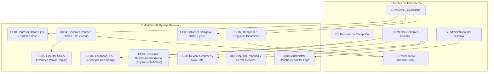
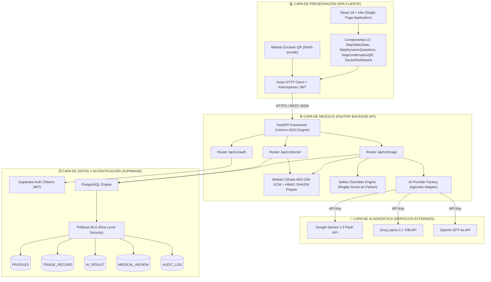
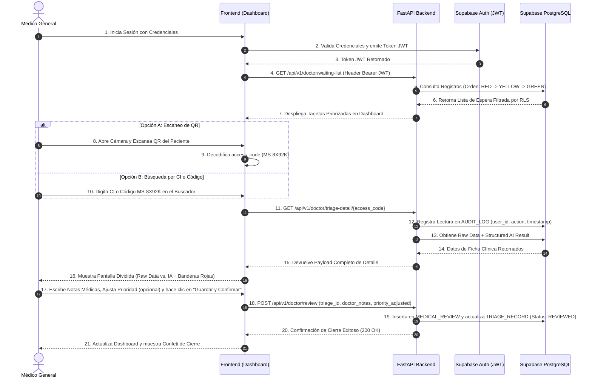
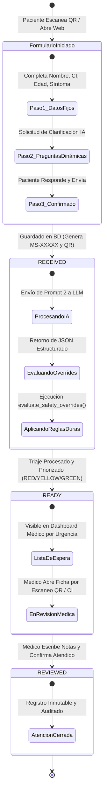
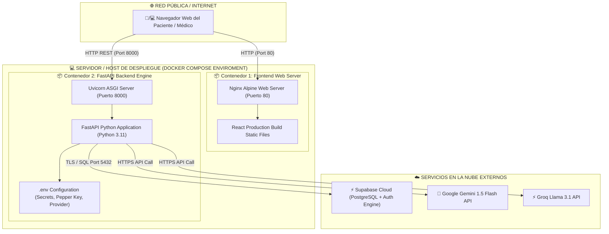
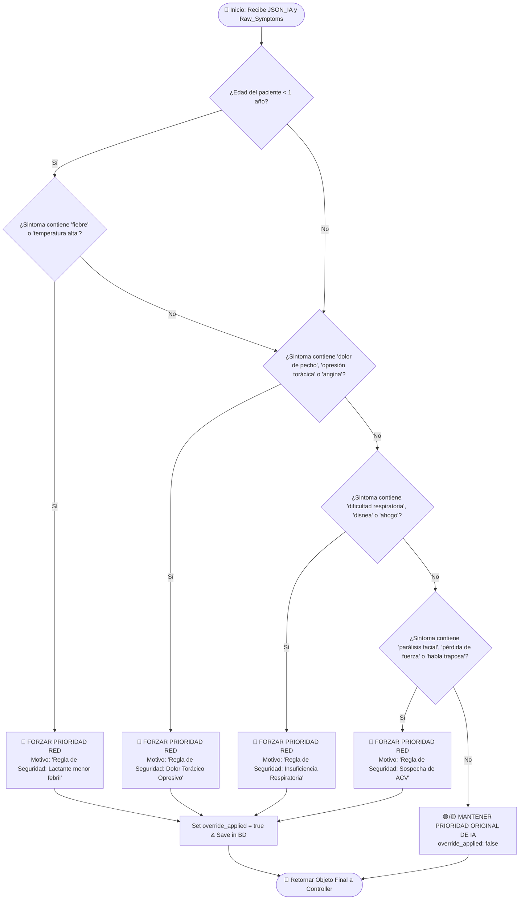

# GUÍA OFICIAL DE DIAGRAMAS DE ARQUITECTURA Y DISEÑO DE SOFTWARE - MEDISINC-IA

**Proyecto:** MediSinc-IA (Sistema de Pre-Triaje Clínico e Inteligencia de Salud)  
**Ubicación:** Santa Cruz de la Sierra, Bolivia  
**Estándar:** Diagramación en Sintaxis Mermaid y UML 2.5  
**Fecha:** Agosto de 2026  

---

## 1. Diagrama de Casos de Uso del Sistema (Use Case Diagram)

Este diagrama representa los actores humanos y sistémicos que interactúan con MediSinc-IA y los casos de uso principales que ejecuta cada uno.



---

## 2. Diagrama de Arquitectura del Sistema C4 / Contenedores (System Architecture Diagram)

Muestra la división en capas desacopladas del sistema: Capa de Presentación (React SPA), Capa de Negocio (FastAPI REST Backend), Capa de IA Agnóstica (Factory Pattern) y Capa de Persistencia y Seguridad (Supabase PostgreSQL + Auth + RLS).



---

## 3. Diagrama de Secuencia 1: Flujo de Pre-Triaje del Paciente con IA y Safety Overrides

Ilustra la interacción ordenada paso a paso desde que el paciente llena el formulario público hasta la generación del resumen por IA, evaluación del motor de reglas duras y renderizado del Código QR.

```mermaid
sequenceDiagram
    autonumber
    actor P as Paciente / Ciudadano
    participant FE as Frontend React
    participant API as FastAPI Backend
    participant SEC as Security Module (AES/HMAC)
    participant AI as AI Provider (Gemini/Groq)
    participant OVER as Safety Overrides Engine
    participant DB as Supabase PostgreSQL

    P->>FE: 1. Completa Datos Fijos (Nombre, CI, Edad, Síntoma Base)
    FE->>API: 2. POST /api/v1/triage/dynamic-questions (Síntoma Base)
    API->>AI: 3. Prompt 1: Solicita 2-3 Preguntas Dinámicas
    AI-->>API: 4. Retorna JSON de Preguntas Dinámicas
    API-->>FE: 5. Devuelve Preguntas Dinámicas al Paciente
    P->>FE: 6. Responde Preguntas Dinámicas y Confirma Registro
    
    FE->>API: 7. POST /api/v1/triage/process (Payload Completo)
    API->>SEC: 8. Cifra CI (AES-256-GCM) y Genera Hash (HMAC-SHA256)
    API->>DB: 9. Inserta en TRIAGE_RECORD (Estado: RECEIVED)
    
    API->>AI: 10. Prompt 2: Solicita Resumen Clínico Estructurado Pydantic
    AI-->>API: 11. Retorna JSON Estructurado (Prioridad Sugerida: GREEN/YELLOW/RED)
    
    API->>OVER: 12. evaluate_safety_overrides(JSON_IA, Raw_Symptoms)
    alt Detecta Banderas Rojas (ej. Dolor Pecho, Lactante Febril)
        OVER-->>API: 13. Forzar Prioridad RED (override_applied: true)
    else Sin Banderas Rojas
        OVER-->>API: 14. Mantener Prioridad IA (override_applied: false)
    end

    API->>DB: 15. Guarda resultado en AI_RESULT y actualiza TRIAGE_RECORD (Estado: READY)
    API-->>FE: 16. Retorna access_code (MS-8X92K), Prioridad y Token QR
    FE-->>P: 17. Muestra Código MS-8X92K y Renderiza Código QR Interactivo
```

---

## 4. Diagrama de Secuencia 2: Flujo de Atención Médica, Escaneo QR y Cierre Clínico

Muestra el flujo que realiza el profesional médico para buscar a un paciente, escanear su QR, revisar el informe comparativo y cerrar la consulta.



---

## 5. Diagrama Entidad-Relación de Base de Datos (ERD Diagram)

Muestra las 5 tablas del esquema de base de datos PostgreSQL en Supabase, indicando llaves primarias (`PK`), llaves foráneas (`FK`), tipos de datos, cardinalidades y restricciones RLS.

```mermaid
erDiagram
    PROFILES ||--o{ MEDICAL_REVIEW : "realiza (1:N)"
    PROFILES ||--o{ AUDIT_LOG : "genera (1:N)"
    TRIAGE_RECORD ||--|| AI_RESULT : "posee (1:1)"
    TRIAGE_RECORD ||--o| MEDICAL_REVIEW : "recibe (1:1)"
    TRIAGE_RECORD ||--o{ AUDIT_LOG : "referencia (1:N)"

    PROFILES {
        uuid id PK
        uuid user_id FK
        string full_name
        string role "DOCTOR | ADMIN"
        timestamptz created_at
    }

    TRIAGE_RECORD {
        uuid id PK
        string access_code UK "ej. MS-8X92K"
        string ci_hash INDEX "HMAC-SHA256 Pepper"
        text ci_encrypted "AES-256-GCM"
        string patient_name
        int age
        string gender
        text raw_symptoms
        jsonb static_data
        jsonb dynamic_answers
        string status "RECEIVED | READY | REVIEWED"
        string final_priority "RED | YELLOW | GREEN"
        timestamptz created_at
    }

    AI_RESULT {
        uuid id PK
        uuid triage_id FK, UK
        string provider "gemini | groq | openai"
        string model "gemini-1.5-flash"
        jsonb structured_result "Contrato Pydantic"
        boolean override_applied
        text override_reason
        timestamptz created_at
    }

    MEDICAL_REVIEW {
        uuid id PK
        uuid triage_id FK
        uuid doctor_id FK
        text doctor_notes
        string priority_adjusted
        timestamptz reviewed_at
    }

    AUDIT_LOG {
        uuid id PK
        uuid user_id FK
        string action "SEARCH | VIEW | REVIEW | LOGIN"
        uuid resource_id
        string ip_address
        timestamptz timestamp
    }
```

---

## 6. Diagrama de Estados del Registro de Triaje (State Diagram)

Muestra el ciclo de vida de una atención de pre-triaje desde su creación pública hasta su resolución y archivo médico.



---

## 7. Diagrama de Despliegue de Infraestructura y Docker (Deployment Diagram)

Representa la topología física y lógica de despliegue containerizado multi-etapa utilizando Docker Compose.



---

## 8. Diagrama de Flujo del Motor de Reglas Duras (Safety Overrides Flowchart)

Muestra el algoritmo determinista ejecutado en Python por `evaluate_safety_overrides()` para anular o ratificar la sugerencia del modelo de Inteligencia Artificial.


